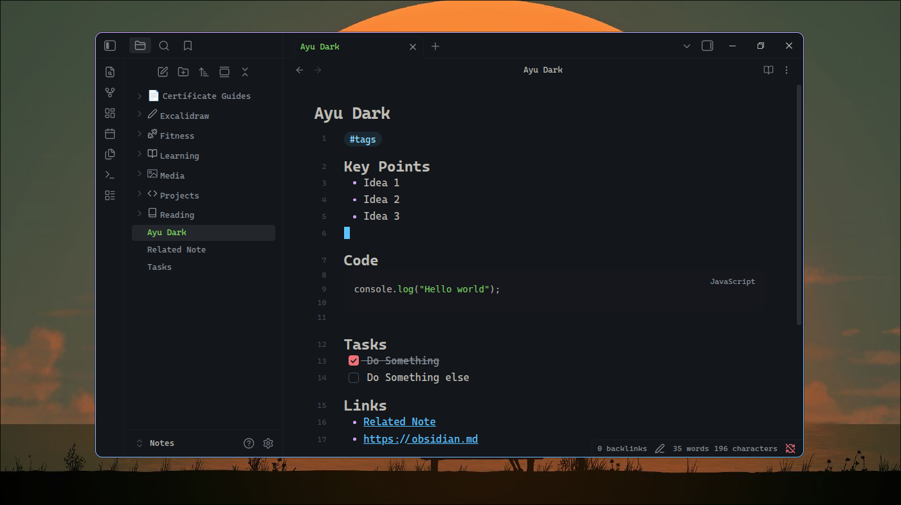

# Ayu Dark

**Ayu Dark ** is an Obsidian port of [Ayu Dark](https://github.com/ayu-theme/ayu-colors) by [Ayu Dark Team](https://github.com/ayu-theme), created as a streamlined alternative to existing variations. It provides style and efficiency through its minimalistic look and colored emphases.

> Ayu Dark is currently **dark-mode only**.

## Features

- Pleasant and subtle Everforest color scheme
- Visual separation with colored elements
- Reduced eye strain via a dimmed background
- Sleek mono-color headings
- Readable code blocks based on Everforest's highlighting rules
- Simplified tables for a solidifed design

## Attribution
This theme is based on the [Everforest Spruce](https://github.com/vupdivup/obsidian-everforest-spruce) theme created by [vupdivup](https://github.com/vupdivup/).  
Modifications have been made to adapt it to the Ayu Dark color scheme.
